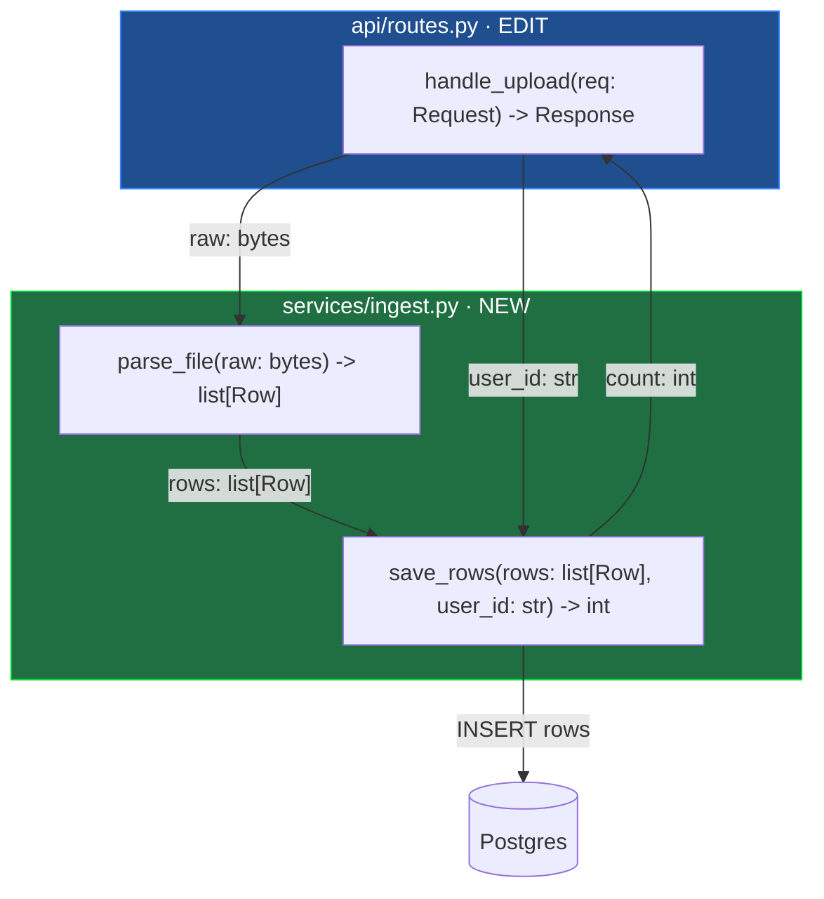

# Map First: Draw the Change Before You Build It

Do not write implementation code yet. First produce **one mermaid diagram** that
maps the whole change at the file and function level. This is a contract with the
user. They approve the map, then you code to it.

## What the map must show

- **Every file** you will touch, as a `subgraph`. Label new files `NEW` and
  existing files `EDIT`.
- **Every new or changed function** inside its file, as a node. The node label is
  the **function signature**: name, parameters with types, return type. Nothing else.
- **Dataflow arrows** between functions. Each arrow is labelled with the **data
  that passes** (the argument or return value), not a vague verb. `-->|user_id: str|`
  not `-->|calls|`.
- **External edges** to things you do not own (DB, HTTP client, queue, third-party
  SDK) as stadium nodes, so the boundary of the change is visible.

## What the map must NOT show

- No logic inside functions. No `if`/`for`/loops, no line-by-line steps.
- No unchanged functions, unless one is a call target that makes the flow readable.
- No prose paragraphs describing the code. The diagram carries the design.

## Template



## Render it so the user can see it

A fenced mermaid block is source code. Most terminals and agent CLIs show it raw,
not as a picture. So **always render the diagram to a viewable file and open it**,
in addition to putting the block in your reply.

Write the map to a `.mmd` source file and a self-contained HTML wrapper, then open
the HTML:

```bash
mkdir -p .map-first
cat > .map-first/map.mmd <<'MMD'
PASTE_THE_MERMAID_SOURCE_HERE
MMD
cat > .map-first/map.html <<'HTML'
<!doctype html><meta charset="utf-8">
<title>map-first</title>
<body style="margin:0;overflow:hidden;background:#0b0f14">
<pre class="mermaid" style="margin:0">
PASTE_THE_MERMAID_SOURCE_HERE
</pre>
<script src="https://cdn.jsdelivr.net/npm/svg-pan-zoom@3.6.1/dist/svg-pan-zoom.min.js"></script>
<script type="module">
import mermaid from "https://cdn.jsdelivr.net/npm/mermaid@11/dist/mermaid.esm.min.mjs";
mermaid.initialize({ startOnLoad: false, theme: "dark", maxTextSize: 200000 });
await mermaid.run();
const svg = document.querySelector(".mermaid svg");
if (svg) {
  svg.style.width = "100vw"; svg.style.height = "100vh"; svg.style.maxWidth = "none";
  svgPanZoom(svg, { controlIconsEnabled: true, fit: true, center: true });
}
</script>
HTML
open .map-first/map.html   # macOS. Linux: xdg-open. WSL: wslview
```

Replace `PASTE_THE_MERMAID_SOURCE_HERE` with the exact `flowchart` body (no
backticks). The browser renders it with pan and zoom, which matters because these
maps get wide. Keep the raw mermaid block in your reply too, as a fallback for
surfaces that do render it (GitHub, Notion).

Do not add heavy tooling. No `npm install`, no `mermaid-cli`, no Chromium. The CDN
import needs only a browser, which the user's machine already has. If you truly
need a shareable PNG or PDF, tell the user they can run
`npx @mermaid-js/mermaid-cli -i .map-first/map.mmd -o map.png` themselves; do not
install it for them.

## After the diagram

Add a short bullet list only if it is not obvious from the map:

- **Open questions**: anything you assumed about a signature or a data shape.
- **Order**: which files to build first if the sequence matters.

Then stop and ask:
> Does this map match what you want? I will code to it once you confirm.

## Rules

**One diagram, whole change.** If the change spans ten files, they all go on one
map. A partial map hides the coupling that the map exists to reveal.

**Signatures are the point.** A node without types is not a contract. Commit to
parameter and return types now; that is the decision the map forces you to make.

**Every arrow names its payload.** An unlabelled arrow, or one labelled `calls`,
tells the user nothing. Name the value that moves.

**Read before you draw.** For edits to existing files, read the current signatures
first so the map is accurate, not guessed.

**Do not code until the map is approved.** The map is cheap to change; the code is
not. Fix the design on the diagram.

## Shortcuts

`/map-first <feature>` - Draw the map for the described change.

`/map-first update` - Redraw the map after the user changed a requirement.
